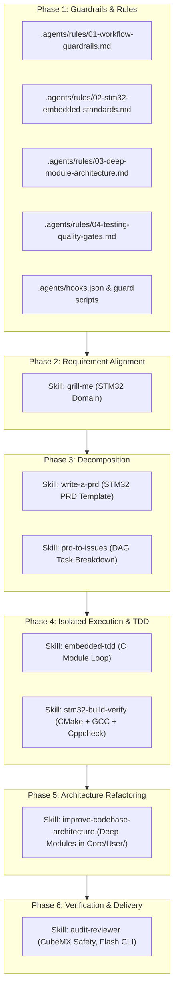

# Implementation Architecture: STM32 AI Coding System for Antigravity 2.0

Comprehensive system of **Rules, Skills, Hooks, and Guidelines** for Antigravity 2.0, optimized for embedded software engineers developing firmware on the STM32 platform (STM32F4 / Cortex-M4, STM32CubeMX, HAL/LL, CMake/Ninja, STM32CubeProgrammer CLI) aligned with the 6-phase engineering pipeline defined in [AI_Coding.mmd](file:///e:/CODE/STM32_IDE/STM32_MX/Dev_embedded_architecture/.agents/AI_Coding.mmd).

---

## Architecture Overview (Mapping to `AI_Coding.mmd`)

---

## Summary of Components

### 1. Workspace Rules (`.agents/rules/` & `AGENTS.md`)
- **01-workflow-guardrails.md**: 6-phase workflow enforcement and hard boundaries (protecting `cmake/stm32cubemx/`, preserving `/* USER CODE */` blocks, static memory only).
- **02-stm32-embedded-standards.md**: STM32Cube HAL/LL conventions, DMA streams, CMSIS atomic sections (`__disable_irq()`, `__set_PRIMASK()`), and low-power modes.
- **03-deep-module-architecture.md**: Deep Module layout in `Core/User/<module>/` with minimal public headers and file-scoped static state.
- **04-testing-quality-gates.md**: Verification commands (`cmake --preset Debug`, `cppcheck Core/User/`, `STM32_Programmer_CLI`).

### 2. Specialized Skills (`.agents/skills/`)
- **grill-me**: Multi-stage technical interview for STM32 peripherals, pinouts, clock tree, and execution model.
- **write-a-prd**: Structured PRD generation with STM32 peripheral allocation tables and memory budgets.
- **prd-to-issues**: Decomposing PRDs into vertical tracer bullets and a task DAG.
- **embedded-tdd**: Red-Green-Refactor loop decoupling pure algorithms from hardware registers.
- **stm32-build-verify**: CMake compile check and flashing with `STM32_Programmer_CLI`.
- **improve-codebase-architecture**: Auditing modules in `Core/User/` to hide private helper functions with `static`.
- **audit-reviewer**: Clean-context review checking memory bounds, CubeMX integrity, and generating `walkthrough.md`.

### 3. Scripts & Safety Hooks (`.agents/scripts/`)
- **guard_autogen.ps1** / **guard_autogen.py**: PreToolUse hooks intercepting tool calls to block modifications to `cmake/stm32cubemx/`, `.mxproject`, or `Drivers/`.
- **build_check.ps1**: Rapid PowerShell build script compiling the active CMake preset (`Debug`).
