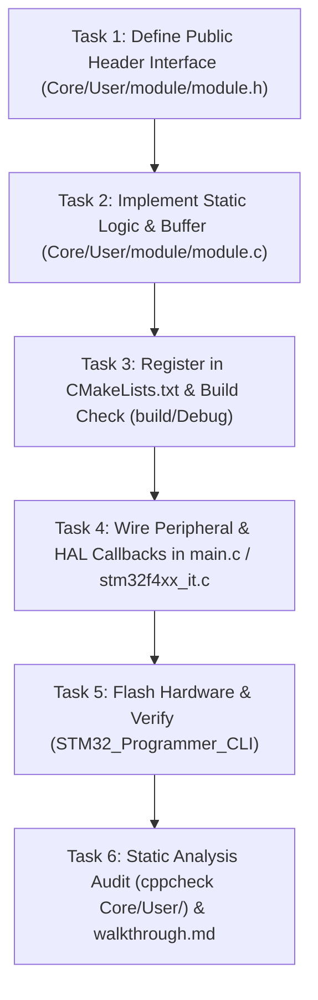

# PRD Decomposition & DAG Builder (`/prd-to-issues`)

Use this skill after a PRD is approved to break down implementation into small, testable, vertical tracer bullets.

---

## 1. Vertical Tracer Bullet Philosophy

Avoid horizontal layering where you configure all hardware peripherals first without testing logic end-to-end.
Instead, build **thin vertical slices**:

```text
Tracer Bullet 1: Pure Logic / Data Structure
[Header Definition] ──> [Static Buffer / Algorithm] ──> [Build & Unit Check]

Tracer Bullet 2: CMake & Driver Wiring
[Register in CMakeLists.txt] ──> [HAL Peripheral Callback Hook] ──> [Integration in main.c]

Tracer Bullet 3: Hardware Verification & Diagnostics
[Flash Target via SWD] ──> [Verify Output / Logging] ──> [Handle Edge Cases (Overrun/Timeout)]
```

---

## 2. DAG Task Graph Template

Output the task breakdown with explicit dependencies in your task plan:



---

## 3. Issue Specification Format

For each task in the plan:
1. **Task ID & Name**: e.g., `Task 1: Define ring_buffer.h public interface`
2. **Inputs / Dependencies**: Which previous tasks must be complete.
3. **Files to touch**: Exact list of files (`Core/User/<module>/`, `CMakeLists.txt`, `Core/Src/main.c`).
4. **Verification Step**: Immediate automated command to verify completion (`cmake --build build/Debug`, etc.).
