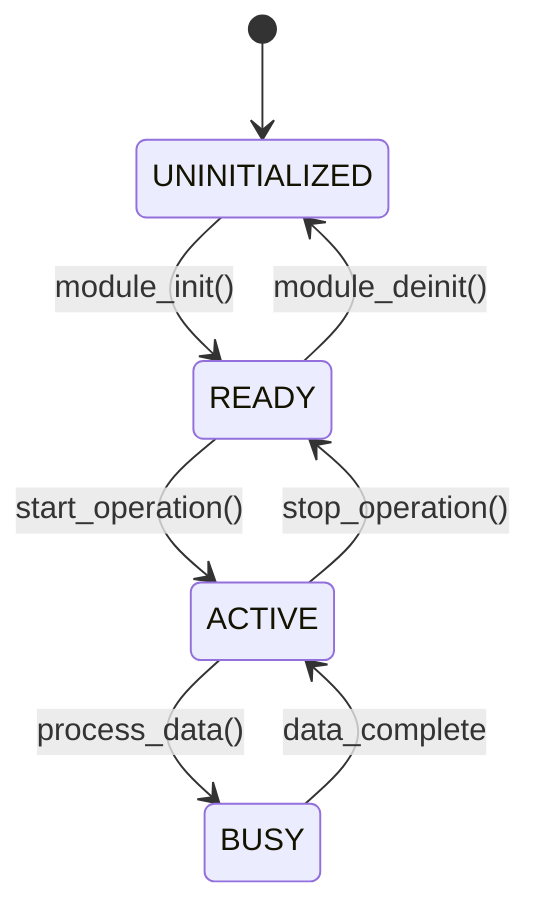

# Embedded PRD Generator (`/write-a-prd`)

Use this skill after completing the `/grill-me` interview to generate a structured, unambiguous requirements specification before coding.

---

## PRD Structure (`PRD-<feature>.md`)

The generated PRD artifact must follow this standard format:

```markdown
# PRD: [Feature Name] - STM32 Firmware Module

## 1. Executive Summary & Goals
- Brief description of the module/feature.
- Value proposition and functional goals.
- Non-goals (explicitly what this feature will NOT do).

## 2. Target Hardware & Peripheral Allocation
- **Target MCU:** STM32 Series (e.g. STM32F411xE / ARM Cortex-M4 with FPU).
- **Pin & Peripheral Mapping:**
  | Peripheral | Pin | Mode / Alternate Function | Notes |
  | :--- | :--- | :--- | :--- |
  | USART2 | PA2 (TX), PA3 (RX) | AF07 (115200 8N1) | VCOM / CLI |
  | TIM2 | Internal | Periodic Update (1ms) | Systick / Timebase |
  | DMA1_Stream5 | PA3 | Circular Mode | UART RX Buffer |

## 3. Architecture & Data Structures
### A. Module Layout
- Path: `Core/User/<module_name>/`
- Public Header: `<module_name>.h`
- Private Implementation: `<module_name>.c`

### B. State Machine Architecture


## 4. Concurrency, Power & Memory Budget

- **Execution Model:** Non-blocking state machine in `main.c` OR FreeRTOS Task (`Priority: osPriorityNormal`, `Stack: 256 words`).
- **Interrupts & Callbacks:** Specific HAL callbacks handled (e.g. `HAL_UART_RxCpltCallback`).
- **Critical Sections:** Protected via CMSIS `__disable_irq()` / `__set_PRIMASK()`.
- **Memory Budget:** Max RAM: `X KB`, Max Flash: `Y KB` (Statically allocated).

## 5. Public API Interface

- List of 3–7 public functions in `<module_name>.h`:
  - `HAL_StatusTypeDef <module>_init(void);`
  - `void <module>_process(void);`
  - Getters / Putters / Handlers.

## 6. Verification & Acceptance Criteria

- [ ] Compiles cleanly with `cmake --build build/Debug`.
- [ ] Passes static analysis (`cppcheck Core/User/`).
- [ ] Verified on hardware via `STM32_Programmer_CLI`.

```

```
