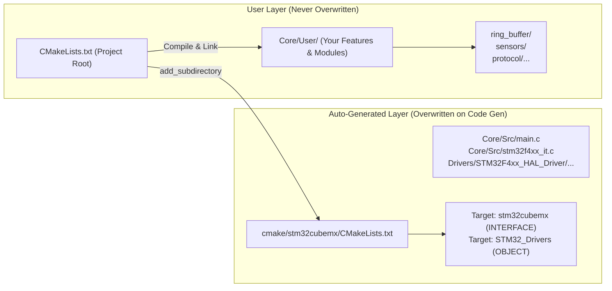
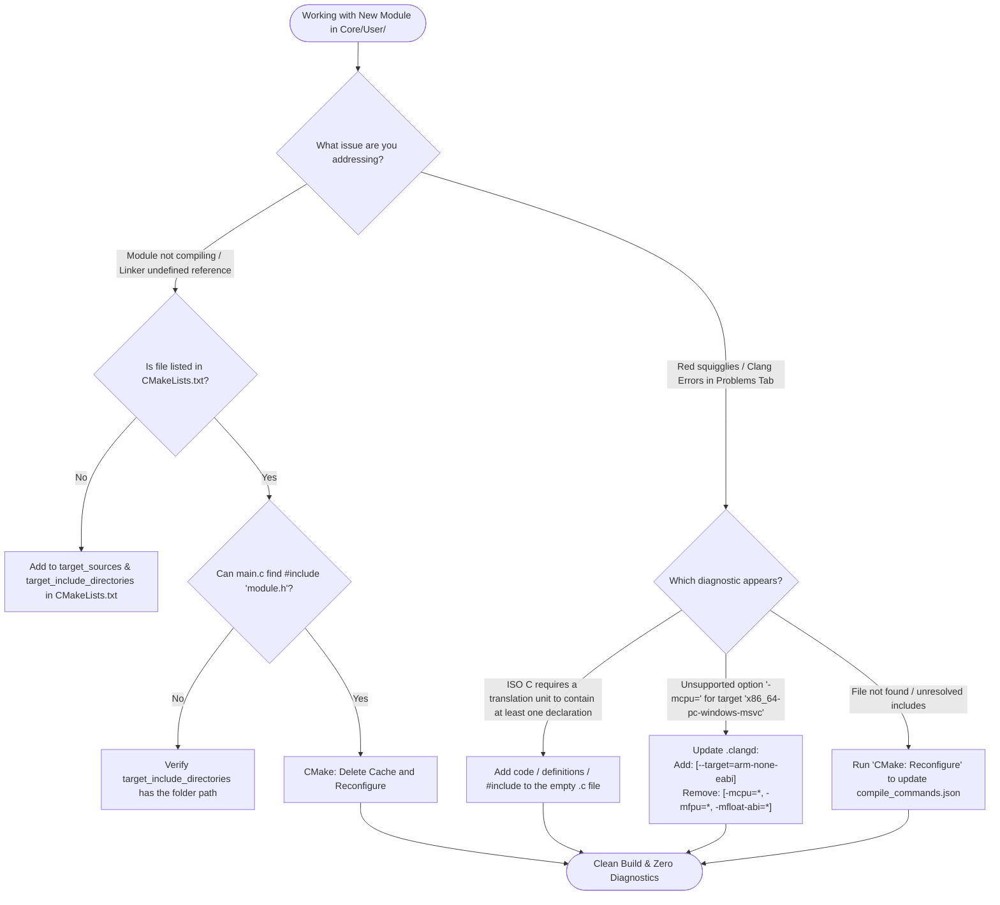
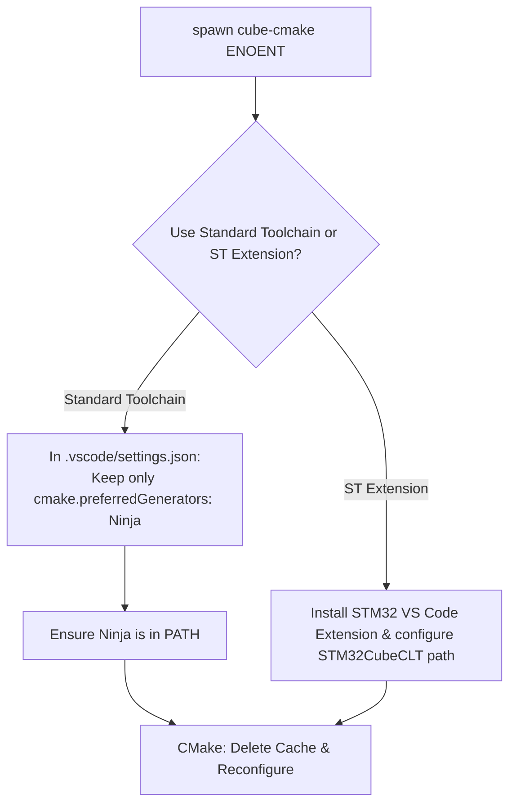
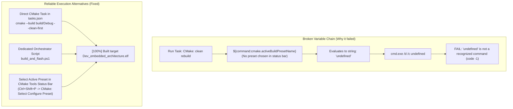

# Project Engineering Guide & Troubleshooting Manual

---

## 1. Module Architecture: Adding `Core/User/` Modules to Build Files

### 1.1 Build File Anatomy: CubeMX vs. User Space

In an STM32CubeMX CMake project, responsibility is strictly bifurcated:



> [!IMPORTANT]
> **Never modify** `cmake/stm32cubemx/CMakeLists.txt` to add your user modules because STM32CubeMX overwrites this file every time you regenerate code in CubeMX. All user modules belong in the root [CMakeLists.txt](file:///CMakeLists.txt) or custom user CMake subdirectories.

---

### 1.2 How to Configure [CMakeLists.txt](file:///CMakeLists.txt) for `Core/User`

There are two primary patterns to include `Core/User` modules.

#### Option A: Explicit Declarations in Root [CMakeLists.txt](file:///CMakeLists.txt) (Standard & Explicit)

In [CMakeLists.txt](file:///CMakeLists.txt), locate lines 49–56 and add your sources and include paths:

```cmake
# Add sources to executable
target_sources(${CMAKE_PROJECT_NAME} PRIVATE
    # Add user sources here
    Core/User/ring_buffer/ring_buffer.c
)

# Add include paths
target_include_directories(${CMAKE_PROJECT_NAME} PRIVATE
    # Add user defined include paths
    Core/User/ring_buffer
)
```

#### Option B: Modular Architecture via `add_subdirectory` (Recommended for Scalability)

If you plan to add multiple modules (e.g. `ring_buffer`, `sensors`, `cli`), isolate user modules into their own `CMakeLists.txt`:

1. In [CMakeLists.txt](file:///CMakeLists.txt), add:
   ```cmake
   add_subdirectory(Core/User)
   ```
2. Create a new file `Core/User/CMakeLists.txt`:
   ```cmake
   # Core/User/CMakeLists.txt
   target_sources(${CMAKE_PROJECT_NAME} PRIVATE
       ${CMAKE_CURRENT_SOURCE_DIR}/ring_buffer/ring_buffer.c
   )

   target_include_directories(${CMAKE_PROJECT_NAME} PRIVATE
       ${CMAKE_CURRENT_SOURCE_DIR}/ring_buffer
   )
   ```

#### Option C: Automatic Globbing (Dynamic Discovery)

If you want any `.c` file and folder inside `Core/User` automatically compiled without editing CMake each time:

```cmake
# Collect all .c files inside Core/User recursively
file(GLOB_RECURSE USER_SOURCES CONFIGURE_DEPENDS
    "${CMAKE_SOURCE_DIR}/Core/User/*.c"
)

target_sources(${CMAKE_PROJECT_NAME} PRIVATE
    ${USER_SOURCES}
)

# Add include directories for all subfolders under Core/User
target_include_directories(${CMAKE_PROJECT_NAME} PRIVATE
    ${CMAKE_SOURCE_DIR}/Core/User
    ${CMAKE_SOURCE_DIR}/Core/User/ring_buffer
)
```

---

## 2. Diagnosing `ring_buffer.c` Clang Diagnostics

### 2.1 Spot Analysis of the 4 Error Messages

```text
(X) Unsupported option '-mcpu=' for target 'x86_64-pc-windows-msvc' clang(drv_unsupported_opt_for_target)
(X) Unsupported option '-mfpu=' for target 'x86_64-pc-windows-msvc' clang(drv_unsupported_opt_for_target)
(X) Unsupported option '-mfloat-abi=' for target 'x86_64-pc-windows-msvc' clang(drv_unsupported_opt_for_target)
(!) ISO C requires a translation unit to contain at least one declaration clang(-Wempty-translation-unit)
```

| Diagnostic Code                                                                        | Underlying Cause                                                                                                                                                                                                                                                                                                                  | Spot Fix                                                                                                    |
| :------------------------------------------------------------------------------------- | :-------------------------------------------------------------------------------------------------------------------------------------------------------------------------------------------------------------------------------------------------------------------------------------------------------------------------------- | :---------------------------------------------------------------------------------------------------------- |
| `clang(-Wempty-translation-unit)`                                                    | [ring_buffer.c](file:///Core/User/ring_buffer/ring_buffer.c) only contains Doxygen comments and 0 lines of code. Standard C requires at least one type, function, or variable declaration in a translation unit.                                                                                                                   | Add`#include "ring_buffer.h"` and implement `void haha() {}`.                                           |
| `clang(drv_unsupported_opt_for_target)` for `-mcpu=`, `-mfpu=`, `-mfloat-abi=` | The Clang language server (`clangd`) running on Windows defaults to host architecture `x86_64-pc-windows-msvc`. When Clang parses GCC cross-compilation flags (`-mcpu=cortex-m4`, `-mfpu=fpv4-sp-d16`, `-mfloat-abi=hard`), it flags an error because x86 MSVC does not have Cortex-M hardware registers or float ABIs. | Configure[.clangd](file:///.clangd) with `--target=arm-none-eabi` and strip incompatible GCC driver flags. |
| Missing from`compile_commands.json`                                                  | Because`ring_buffer.c` was newly created and not yet registered in [CMakeLists.txt](file:///CMakeLists.txt), it is missing from `build/Debug/compile_commands.json`. Clangd falls back to inferring flags with the host default target.                                                                                        | Add file to[CMakeLists.txt](file:///CMakeLists.txt) and reconfigure CMake.                                   |

---

### 2.2 Step-by-Step Fixes

#### Step 1: Implement or Include a Declaration in [ring_buffer.c](file:///Core/User/ring_buffer/ring_buffer.c)

Add code so the translation unit is non-empty:

```c
/**
 * @file ring_buffer.c
 * @brief Ring Buffer Implementation
 */
#include "ring_buffer.h"

void haha(void)
{
    // Implementation
}
```

#### Step 2: Register in [CMakeLists.txt](file:///CMakeLists.txt)

Add `Core/User/ring_buffer/ring_buffer.c` and `Core/User/ring_buffer` to `target_sources` and `target_include_directories`.

#### Step 3: Configure [.clangd](file:///.clangd) for ARM Cross-Target

Update [.clangd](file:///.clangd) in the project root to inform Clangd that the code targets ARM Cortex-M:

```yaml
CompileFlags:
  CompilationDatabase: build/Debug
  Add:
    - --target=arm-none-eabi
  Remove:
    - -mcpu=*
    - -mfpu=*
    - -mfloat-abi=*
```

- `--target=arm-none-eabi`: Switches Clang's internal AST parser from `x86_64-pc-windows-msvc` to ARM embedded ABI.
- `Remove`: Removes GCC-specific flags that Clang's frontend driver does not consume.

#### Step 4: Re-generate the Compilation Database

Press `Ctrl + Shift + P` -> **CMake: Delete Cache and Reconfigure**.
This updates `build/Debug/compile_commands.json` with the new compile command for `ring_buffer.c`.

---

## 3. Connected Knowledge Network (Non-Linear Architecture)

The diagram below connects the build system, language server indexing, file relationships, and architecture targeting:

```mermaid
graph TD
    %% Node Definitions
    subgraph Filesystem_Layer["File System Layer"]
        SRC_USER_C["Core/User/ring_buffer/ring_buffer.c"]
        SRC_USER_H["Core/User/ring_buffer/ring_buffer.h"]
        SRC_MAIN["Core/Src/main.c"]
        HAL_DRV["Drivers/STM32F4xx_HAL_Driver/..."]
    end

    subgraph Build_Orchestration["CMake Build System"]
        CMAKELIST_ROOT["CMakeLists.txt"]
        CMAKELIST_MX["cmake/stm32cubemx/CMakeLists.txt"]
        TOOLCHAIN["cmake/gcc-arm-none-eabi.cmake<br/>target: cortex-m4, hard-float"]
        PRESET["CMakePresets.json<br/>Generator: Ninja"]
    end

    subgraph Compilation_Database["Compilation Artifacts & Indexing"]
        NINJA_BUILD["build/Debug/build.ninja"]
        COMP_DB["build/Debug/compile_commands.json"]
        ELF_OUT["build/Debug/Dev_embedded_architecture.elf"]
    end

    subgraph Language_Server["Static Analysis & IntelliSense Layer"]
        CLANGD_CFG[".clangd configuration"]
        CLANGD_LSP["Clangd Language Server (in VS Code)"]
        HOST_TARGET["Default Host: x86_64-pc-windows-msvc"]
        ARM_TARGET["Target: arm-none-eabi"]
        DIAGNOSTICS{"VS Code Problems View"}
    end

    subgraph Toolchain_Exec["Toolchain Execution"]
        GCC_BIN["arm-none-eabi-gcc.exe"]
        NINJA_BIN["ninja.exe"]
    end

    %% Build Connections
    CMAKELIST_ROOT -->|Includes| TOOLCHAIN
    CMAKELIST_ROOT -->|add_subdirectory| CMAKELIST_MX
    CMAKELIST_ROOT -->|target_sources| SRC_USER_C
    CMAKELIST_ROOT -->|target_include_directories| SRC_USER_H
    CMAKELIST_MX -->|Compiles| SRC_MAIN
    CMAKELIST_MX -->|Compiles| HAL_DRV

    CMAKELIST_ROOT -->|Configures via Ninja| NINJA_BUILD
    CMAKELIST_ROOT -->|Generates (CMAKE_EXPORT_COMPILE_COMMANDS)| COMP_DB

    NINJA_BUILD -->|Executes| NINJA_BIN
    NINJA_BIN -->|Calls| GCC_BIN
    GCC_BIN -->|Outputs Binary| ELF_OUT

    %% Language Server Connections
    COMP_DB -. Reads compile flags .-> CLANGD_LSP
    CLANGD_CFG -. Overrides Target & Removes Flags .-> CLANGD_LSP

    SRC_USER_C -. Analyzed by .-> CLANGD_LSP

    CLANGD_LSP -->|Without .clangd override| HOST_TARGET
    HOST_TARGET -->|Rejects -mcpu=cortex-m4| DIAGNOSTICS
    CLANGD_LSP -->|With .clangd: --target=arm-none-eabi| ARM_TARGET
    ARM_TARGET -->|Clean AST Resolution| DIAGNOSTICS

    SRC_USER_C -. If 0 declarations .->|Trigger -Wempty-translation-unit| DIAGNOSTICS
    SRC_USER_C -. "#include ring_buffer.h" .-> SRC_USER_H
```

---

## 4. Multi-Branch Diagnostic & Action Flow



---

## 5. Appendix: Previous Troubleshooting: `Error: spawn cube-cmake ENOENT`

### 5.1 Spot-Point Summary

| Attribute            | Details                                                                                                                                                                                                                         |
| :------------------- | :------------------------------------------------------------------------------------------------------------------------------------------------------------------------------------------------------------------------------ |
| **Error**      | `[proc] The command: cube-cmake --version failed with error: Error: spawn cube-cmake ENOENT`                                                                                                                                  |
| **Root Cause** | In[.vscode/settings.json](file:///.vscode/settings.json), `"cmake.cmakePath"` was hardcoded to `"cube-cmake"`. The OS could not find any executable named `cube-cmake` in system `PATH`.                                 |
| **Solution**   | Remove`"cmake.cmakePath"` and `"cmake.configureArgs"` from [.vscode/settings.json](file:///.vscode/settings.json) to use standard CMake (`C:\Program Files\CMake\bin\cmake.exe`), and ensure `ninja.exe` is in `PATH`. |



---

## 6. Troubleshooting: `"undefined" is not a recognized command` on `CMake: clean rebuild`

### 6.1 Spot-Point Summary

| Attribute              | Details                                                                                                                                                                                                                                                                  |
| :--------------------- | :----------------------------------------------------------------------------------------------------------------------------------------------------------------------------------------------------------------------------------------------------------------------- |
| **Error Log**    | `Executing task: CMake: clean rebuild"undefined" is not a recognized command.``The terminal process failed to launch (exit code: -1).`                                                                                                                               |
| **Trigger**      | Running task`CMake: clean rebuild` from the VS Code Task menu (`Terminal -> Run Task...`).                                                                                                                                                                           |
| **Root Cause 1** | In`.vscode/tasks.json`, the task specified `"preset": "${command:cmake.activeBuildPresetName}"`. When no preset is actively selected in the CMake Tools status bar, VS Code resolves `${command:...}` to the literal JavaScript token `undefined`.               |
| **Root Cause 2** | The global`"windows": { "options": { "shell": { "executable": "cmd.exe", "args": ["/d", "/c"] } } }` forced VS Code to spawn `cmd.exe /d /c undefined`. Windows Command Prompt searched for an executable named `undefined.exe` and aborted with exit code `-1`. |

---

### 6.2 Failure Mechanism vs. Fixed Architecture



---

### 6.3 How It Was Fixed in `.vscode/tasks.json`

The [.vscode/tasks.json](file:///.vscode/tasks.json) configuration has been updated to remove fragile `${command:...}` substitutions and eliminate the global `cmd.exe` shell wrapper:

1. **`Build: Clean Rebuild (build_and_flash.ps1)`** is configured as the default build task (`"isDefault": true`), allowing you to trigger clean rebuilds instantly via **`Ctrl + Shift + B`**:
   ```json
   {
       "type": "shell",
       "label": "Build: Clean Rebuild (build_and_flash.ps1)",
       "command": "powershell",
       "args": [
           "-NoProfile",
           "-ExecutionPolicy", "Bypass",
           "-File", "${workspaceFolder}/build_and_flash.ps1",
           "-Preset", "Debug"
       ],
       "group": {
           "kind": "build",
           "isDefault": true
       },
       "problemMatcher": ["$gcc"]
   }
   ```
2. **`Build + Flash (build_and_flash.ps1)`** runs `build_and_flash.ps1` with the `-Flash` flag.
3. **`CubeProg: Flash project (SWD)`** targets the concrete ELF path `${workspaceFolder}/build/Debug/Dev_embedded_architecture.elf`.


---

## 6.4 PowerShell Orchestrator: `build_and_flash.ps1`

A standalone script [build_and_flash.ps1](file:///build_and_flash.ps1) is now available in the project root to perform clean rebuilds, memory footprint analysis, and hardware flashing without depending on VS Code extension states.

#### Usage Examples

```powershell
# 1. Clean rebuild only (Debug preset)
.\build_and_flash.ps1

# 2. Clean rebuild + Flash over ST-Link / SWD
.\build_and_flash.ps1 -Flash

# 3. Fast incremental build + Flash (skip clean)
.\build_and_flash.ps1 -Clean:$false -Flash

# 4. Release build + Flash
.\build_and_flash.ps1 -Preset Release -Flash
```

#### Script Features

- **Auto-Configures:** Runs `cmake --preset <Preset>` if the `build/<Preset>` directory does not exist.
- **Clean First:** Invokes `cmake --build build/<Preset> --clean-first` to ensure no stale object files remain.
- **Size Audit:** Displays Flash and RAM consumption using `arm-none-eabi-size`.
- **Hardware Flashing:** Automatically locates `STM32_Programmer_CLI` (in `PATH` or standard ST installation directory) and flashes over SWD with hard reset and execution start.

---

### 6.5 Troubleshooting: `running scripts is disabled on this system (PSSecurityException)`

If running `.\build_and_flash.ps1` produces:
```text
File ...\build_and_flash.ps1 cannot be loaded because running scripts is disabled on this system.
CategoryInfo: SecurityError: (:) [], PSSecurityException
```

By default, Windows restricts running unsigned `.ps1` files in PowerShell. Choose one of the 3 solutions below:

#### Method 1: Enable Script Execution for Current User (Recommended - One-time setup)
Run this once in PowerShell (does **not** require Administrator privileges):
```powershell
Set-ExecutionPolicy -ExecutionPolicy RemoteSigned -Scope CurrentUser
```
*(Press `Y` to confirm).* You can now run `.\build_and_flash.ps1` directly anytime.

#### Method 2: Use the `.bat` Wrapper (No Configuration Needed)
A wrapper [build_and_flash.bat](file:///build_and_flash.bat) is provided that automatically bypasses the execution policy:
```cmd
# Clean rebuild:
.\build_and_flash.bat

# Clean rebuild + Flash:
.\build_and_flash.bat -Flash
```

#### Method 3: Run with `-ExecutionPolicy Bypass` Flag
```powershell
powershell -ExecutionPolicy Bypass -File .\build_and_flash.ps1 -Flash
```

